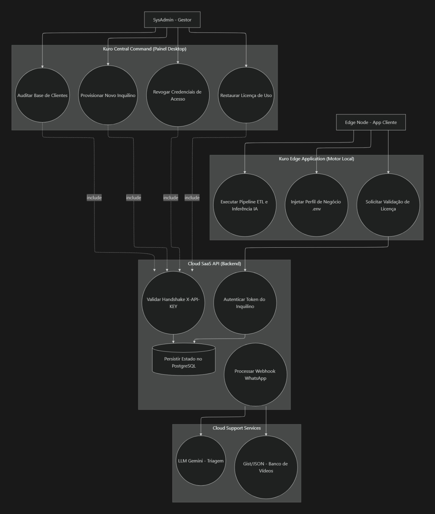
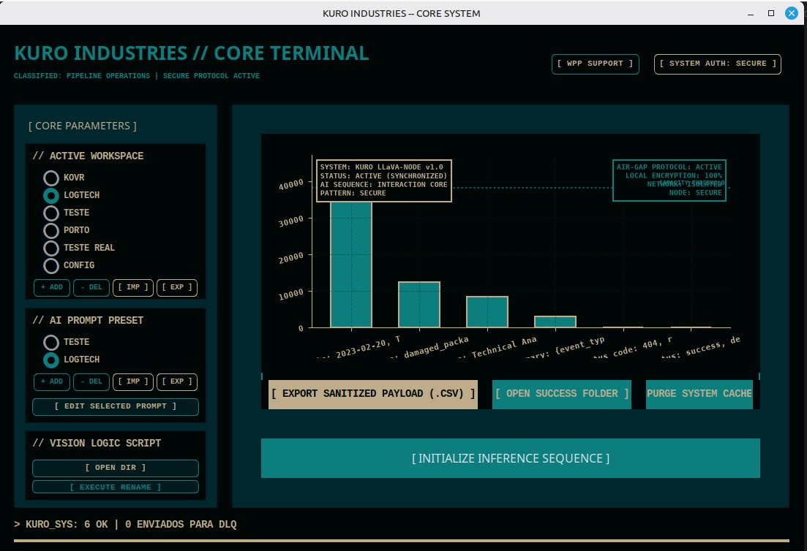
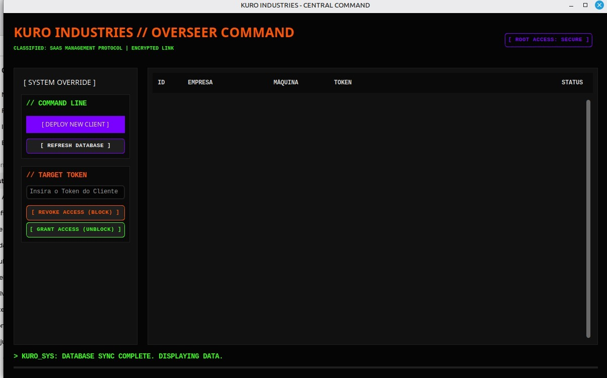

Documentação de Arquitetura: Kuro Industries SaaS
Este documento detalha a topologia, o fluxo de dados e os protocolos de segurança do ecossistema Kuro SaaS. O sistema adota uma arquitetura híbrida (Edge-to-Cloud), onde 100% do processamento de dados e inferência de Inteligência Artificial ocorre localmente na máquina do cliente (Edge Node), enquanto a nuvem (Cloud API) atua exclusivamente como um Gatekeeper de licenciamento e telemetria.

1. O Motor de Processamento (Edge Node Core)
O coração do sistema é um motor de ingestão e processamento de dados completamente agnóstico. Ele não é engessado a um formato de planilha específico, adaptando-se dinamicamente às regras definidas pelo usuário.

Alta Performance com Polars (Lazy Evaluation): A leitura e transformação dos dados utilizam os métodos Lazy da biblioteca Polars (como scan_csv e collect). Isso permite que o sistema crie um plano de execução otimizado antes de processar, garantindo o manuseio de arquivos gigantescos sem estourar a memória RAM da máquina local.

Resiliência e Dead Letter Queue (DLQ): O motor foi desenhado para nunca quebrar a esteira de processamento por erros de tipagem ou formatação. O sistema corrige automaticamente o que é possível. Linhas ou arquivos com erros irrecuperáveis não derrubam a aplicação; eles são ignorados pelo fluxo principal e redirecionados para uma DLQ (Dead Letter Queue) para auditoria posterior.

Dashboard e Gestão de Estado: A interface permite que o usuário baixe a planilha final totalmente higienizada (após o tratamento e exclusão dos itens na DLQ). Além disso, o frontend possui controles diretos para limpar os caches de planilhas e de imagens, impedindo o acúmulo de arquivos temporários no disco.

2. Gestão Dinâmica de Perfis e IA
A aplicação adapta seu comportamento de negócio estruturalmente sem precisar de recompilação, baseando-se em arquivos de configuração flexíveis.

Presets em YAML e Injeção no .env: As regras de leitura (separadores, colunas alvo, restrições) e as configurações de IA são salvas em arquivos .yaml. No frontend, o usuário seleciona o perfil desejado através de um Radio Button. Essa ação dispara um script Python que substitui as variáveis em tempo de execução no arquivo .env, alterando o comportamento do software instantaneamente.

Auto-Prompting Inteligente: O usuário não precisa saber fazer engenharia de prompt. Ele preenche um formulário simples no frontend sobre o que deseja analisar, e o sistema utiliza a própria IA para redigir um "Prompt Profissional" otimizado, que será salvo no preset do cliente e usado nas inferências subsequentes.

Pipeline Condicional de Visão Computacional: O sistema suporta upload de imagens. Uma IA inicial atua como classificador e filtro. Dependendo do resultado dessa triagem (se a imagem atender aos critérios de negócio), o fluxo aciona o modelo LLaVA para uma análise visual profunda.

3. Segurança, Licenciamento e Distribuição (DRM)
Como o sistema é instalado na infraestrutura do cliente, foram aplicadas táticas de Software DRM (Digital Rights Management) e Zero Trust Architecture para proteger a propriedade intelectual e garantir a monetização.

A. Proteção de Código e Empacotamento
Ofuscação e Criptografia: O código-fonte Python é ofuscado e encriptado antes do build, impedindo engenharia reversa.

Distribuição Comercial: O ecossistema é convertido em executáveis independentes via PyInstaller e orquestrado junto com Docker Compose (para levantar os servidores locais do Llama/LLaVA). O instalador final é gerado via Inno Setup.

Trava de Acesso Dupla: O link de download do instalador exige uma senha inicial. Mesmo após instalado, o software é um "casca inútil" até que o administrador crie um Token Específico e Único para a máquina do cliente e o valide na nuvem.

B. Cloud API e Telemetria (Heartbeat)
Isolamento de Dados: A API em nuvem (hospedada no Render com banco PostgreSQL via Supabase) não tem acesso a nenhum arquivo ou dado processado localmente. Ela serve apenas para validar tokens.

Evasão de Firewalls Corporativos: Para evitar que proxys ou firewalls de clientes bloqueiem a comunicação com serviços de nuvem conhecidos, a API responde através de um domínio próprio customizado, mascarando a origem do tráfego.

Tolerância Offline de 7 Dias: Reconhecendo que há clientes com máquinas em ambientes restritos (air-gapped ou com rede instável), o sistema faz o Heartbeat (validação do token na API) e armazena um cache criptografado de autorização. O software só exige uma conexão com a internet uma vez a cada 7 dias. Se não houver revalidação nesse período, o motor local é bloqueado.

Killswitch: O painel do administrador (Central Command) possui um botão de Killswitch. Ao ser acionado, o token do cliente é revogado no banco de dados. Na próxima checagem de rede (ou término do período de 7 dias), o software do cliente se desativa permanentemente.

4. Estrutura de Diretórios (Data Pipeline Local)
O fluxo físico de arquivos reflete o cuidado com a segregação de dados e o padrão DLQ:

data/input/: Ponto de entrada (CSVs originais e imagens brutas).

data/processing/: Arquivos em uso (Lazy Evaluation e Inferência IA).

data/success/: Planilhas higienizadas prontas para download via Dashboard.

data/error_dlq/: (Dead Letter Queue) - Destino das linhas ou arquivos irrecuperáveis.

config/presets/: Arquivos .yaml com as regras de negócio e prompts gerados pela IA.

5. Diagrama de Arquitetura e Casos de Uso (UML)
O diagrama abaixo ilustra a segregação entre o processamento estritamente local, a validação assíncrona na nuvem e o poder de controle do Administrador.

Snippet de código
graph TB
    subgraph CC ["Central Command (Painel Admin)"]
        UC1((Gerar Token de Máquina))
        UC2((Acionar Killswitch / Bloqueio))
        UC3((Auditar Licenças))
    end

    subgraph API ["Cloud SaaS API (Licenciamento)"]
        UC4((Validar Domínio Customizado))
        UC5((Verificar Heartbeat X-API-KEY))
        UC6[(PostgreSQL - Tokens e Status)]
    end

    subgraph EDGE ["Edge Node (App Cliente - DRM Protegido)"]
        UC7((Formulário UI -> Auto-Prompt IA))
        UC8((Troca Dinâmica .env via YAML))
        UC9((Polars Lazy ETL -> Correção))
        UC10((Descarte em DLQ))
        UC11((Classificação de Imagem -> LLaVA))
        UC12((Validação de Token - 7 Dias Cache))
    end

    Admin[SysAdmin] --> UC1
    Admin --> UC2
    Admin --> UC3

    UC1 -. include .-> UC6
    UC2 -. include .-> UC6
    UC3 -. include .-> UC6

    AppLocal[Usuário Local] --> UC7
    AppLocal --> UC8
    AppLocal --> UC9
    AppLocal --> UC11

    UC9 --> UC10
    
    %% Comunicação de Rede Isolada
    UC12 -- "Ping Periódico (Max 7 dias)" --> UC4
    UC4 --> UC5
    UC5 --> UC6

