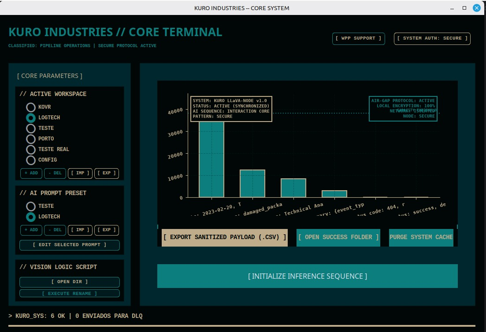
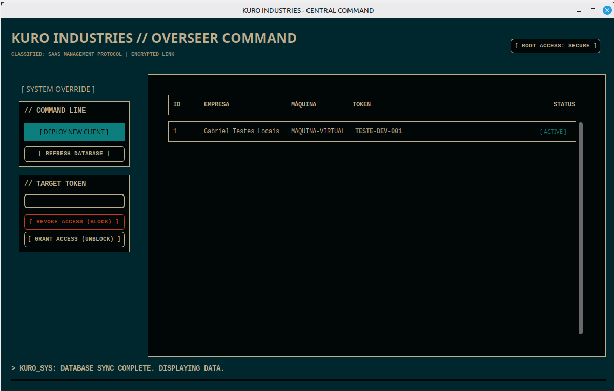

Kuro Industries — Edge AI Data Processing Platform

Estudo de Caso Técnico: Arquitetura de processamento de dados sensíveis com IA local e licenciamento Zero Trust, projetada para operar inteiramente dentro da infraestrutura do cliente.
O Problema

Processar planilhas de negócio com inferência de IA quando os dados não podem, por exigência contratual, sair da máquina do cliente.

Isso descarta qualquer arquitetura SaaS centralizada convencional e exige repensar de onde para onde cada responsabilidade se move: o processamento de dados e a inferência de IA devem ocorrer 100% localmente. A nuvem existe apenas como um gatekeeper para governar quem tem o direito de rodar o software.
Visão Geral da Arquitetura

A solução foi desenhada em três serviços fisicamente isolados, cada um com uma única responsabilidade e uma única audiência:

```mermaid
graph LR
    subgraph Cliente
    A[💻 EDGE NODE<br/>Processamento + IA Local]
    end
    
    subgraph Nuvem Kuro
    B((☁️ CLOUD API<br/>Licenciamento & Telemetria))
    end
    
    subgraph Interno Kuro
    C[🛡️ ADMIN PANEL<br/>Gestão de Licenças]
    end

    A -->|Valida HWID / Token<br/>Zero Data Egress| B
    C -->|Gere Bloqueios / HWID| B

    style A fill:#1e1e1e,stroke:#00aaff,stroke-width:2px,color:#fff
    style B fill:#1e1e1e,stroke:#ffaa00,stroke-width:2px,color:#fff
    style C fill:#1e1e1e,stroke:#00ffaa,stroke-width:2px,color:#fff

Regra de Isolamento Físico: Essa segregação não é apenas conceitual, é uma regra de processo. Os três repositórios nunca são aninhados um dentro do outro. Isso garante que o código-servidor e as ferramentas administrativas jamais sejam acidentalmente empacotados no instalador distribuído ao cliente final.
Motor de Processamento

O core do sistema foi projetado para eficiência de memória e resiliência contra dados malformados:

    Avaliação Preguiçosa (Lazy Evaluation): A leitura, validação e deduplicação de planilhas via Polars constrói um plano de execução antes de ler qualquer linha, evitando carregar o arquivo inteiro em memória.

    Inferência de IA em Blocos: A etapa mais cara (LLMs locais) consome dados em lotes de tamanho fixo. O pico de memória permanece constante independentemente de o arquivo ter 1.000 ou 500.000 registros, mantendo o uso de RAM achatado.

    Fila de Mensagens Mortas (Dead Letter Queue): Nenhum erro de formatação interrompe o processamento do lote. Registros problemáticos são isolados em uma DLQ com o motivo exato do erro para auditoria, nunca descartados silenciosamente.

    Disjuntor (Circuit Breaker): Falhas consecutivas na IA são tratadas como indisponibilidade do serviço (não erro de dado), interrompendo o job de forma controlada para evitar ruído.

    Motor de Regras Plugável: A lógica de negócio é carregada dinamicamente. Colunas, formatos e vocabulário são definidos por configuração declarativa, não no código-fonte, permitindo fallback para regras genéricas.

Pipeline Condicional de IA e Visão Computacional

Abstraímos a complexidade da interação com modelos locais para o usuário final:

    Auto-Prompting Inteligente: O operador descreve sua intenção em linguagem natural no frontend. Um modelo menor redige e salva um prompt profissional otimizado no perfil do cliente para inferências futuras.

    Extração Multimodal (LLaVA): Para registros com imagens anexas, o sistema aciona uma segunda etapa de inferência com um modelo de visão computacional local. A arquitetura de fallback garante que essa etapa pesada seja ignorada em registros puramente textuais.

Camada de Licenciamento (Zero Trust)

Sem ofuscação de binário e sem visibilidade dos dados processados, a proteção da propriedade intelectual depende 100% do protocolo Edge-Cloud:

    Vínculo por Hardware (Trust-on-First-Use): Cada licença se amarra ao hardware (UUID) na primeira ativação válida. Tentativas de uso em outras máquinas são recusadas automaticamente pela API.

    Cache Offline Assinado (HMAC-SHA256): O sistema tolera instabilidade de rede operando em período de carência. A integridade do arquivo .kuro_sync é garantida por assinatura atrelada ao HWID da máquina. Mudar a data ou copiar o arquivo invalida o acesso via comparação de tempo constante (hmac.compare_digest).

    Resposta Assimétrica a Falhas (Killswitch): A thread de licenciamento distingue erros definitivos (401/403) de instabilidades (5xx/Timeout). Apenas negações definitivas encerram o processo na hora, prevenindo que o sistema caia por instabilidade da API.

    Princípio do Menor Privilégio: O Edge Node possui apenas tokens escopados ao próprio cliente, nunca trafegando a chave mestra (X-API-KEY) administrativa nas validações.

Privacidade por Design

O maior inibidor de adoção de IA no ambiente corporativo é o risco de vazamento de dados. Esta arquitetura trata isso como requisito estrutural:

    Zero-Data Egress: O processamento ocorre 100% no cliente. A Cloud API atua exclusivamente como gatekeeper de licenças e nunca recebe dados, planilhas ou conteúdo de negócio.

    Superfície de Auditoria Reduzida: Ao garantir inferência no Edge, eliminamos a necessidade de Acordos de Processamento de Dados (DPAs) com provedores de nuvem (ex: OpenAI, AWS), facilitando a conformidade com frameworks como LGPD e GDPR.

Automação de Suporte via WhatsApp

Integrado diretamente ao mesmo backend de licenciamento, sem infraestrutura adicional (via Meta Cloud API):

    Notificação Proativa: Alertas automáticos ao fim de pipelines longos, eliminando acompanhamento manual.

    Suporte Técnico Auto-Atendido: Usuários enviam códigos de erro e recebem vídeos curtos de resolução.

    Gist Cache Fallback: A base de conhecimento roda num Gist público com TTL em memória. O suporte é atualizável em tempo real sem redeploys, e degrada graciosamente servindo o último cache válido caso o GitHub fique indisponível.

Engenharia de Qualidade

A estabilidade da ponte Edge-Cloud é rigorosamente testada:

    81 Testes Automatizados: Cobrem os backends contra vetores adversariais (adulteração de cache offline, clonagem de HWID, simulação de timeouts e payloads malformados).

    Integração Real: O CI/CD roda contra instâncias reais de PostgreSQL (via GitHub Actions), garantindo que o comportamento reflita o ambiente de produção.

    Regressão de Performance: Testes empíricos com dados sintéticos em escala para comprovar (e não apenas assumir) o comportamento de memória do motor de processamento.

Stack Técnica

    Edge Node: Python, Polars, CustomTkinter, LLaVA / LLMs Locais (Inferência on-device)

    Cloud API: Flask, SQLAlchemy, PostgreSQL, Meta Cloud API

    DevOps / Qualidade: pytest, GitHub Actions, Render

Maturidade e Limitações Conhecidas

Este projeto documenta tanto suas decisões deliberadas quanto suas limitações conhecidas, atualmente priorizadas no roadmap técnico:

    Migração de Schema: Sem integração formal com o Alembic; alterações de banco em produção dependem de comandos ALTER TABLE manuais e idempotentes no boot (suporta novas colunas, mas falha em mutações complexas).

    Rate Limiting: As rotas públicas da API atualmente não possuem limitação de taxa estrita.

    Painel Admin: Ações de manutenção de infraestrutura (resetar HWID, atualizar telefone) são feitas diretamente via chamadas de API, aguardando implementação de UI no SaaS Admin.


